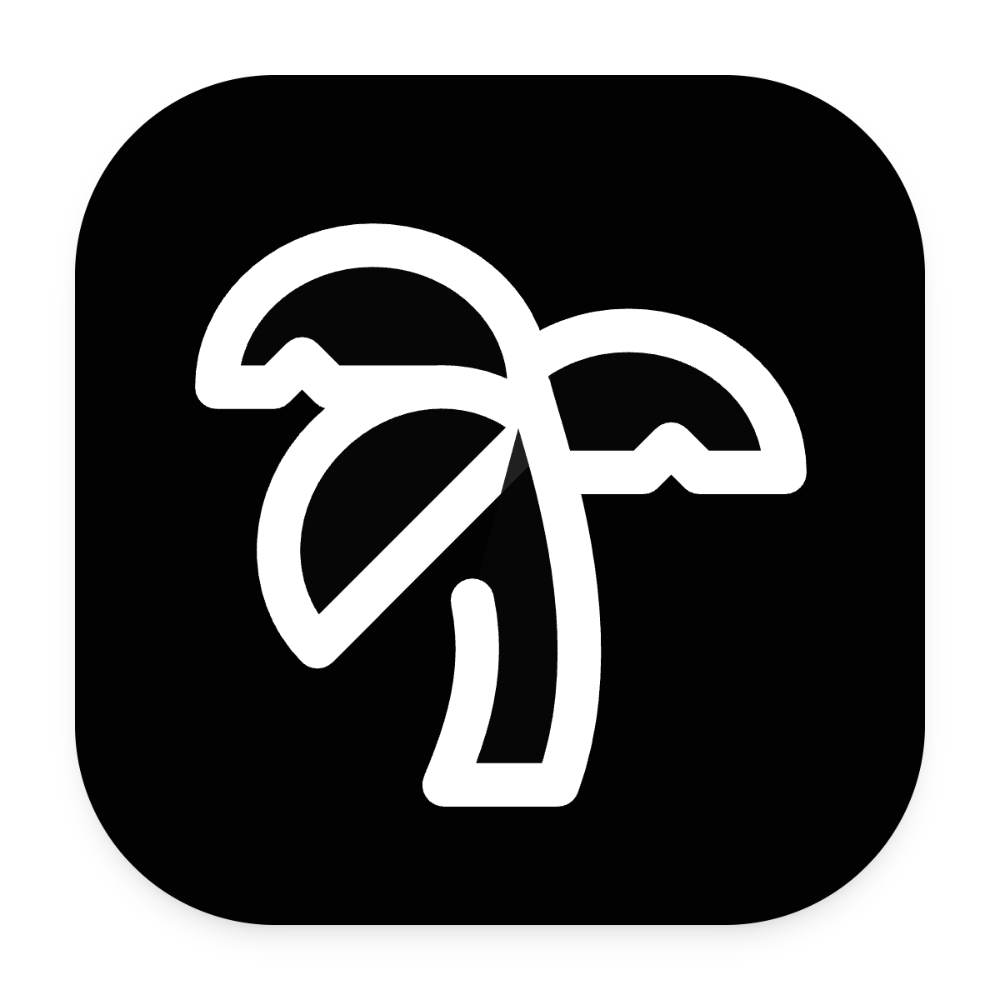
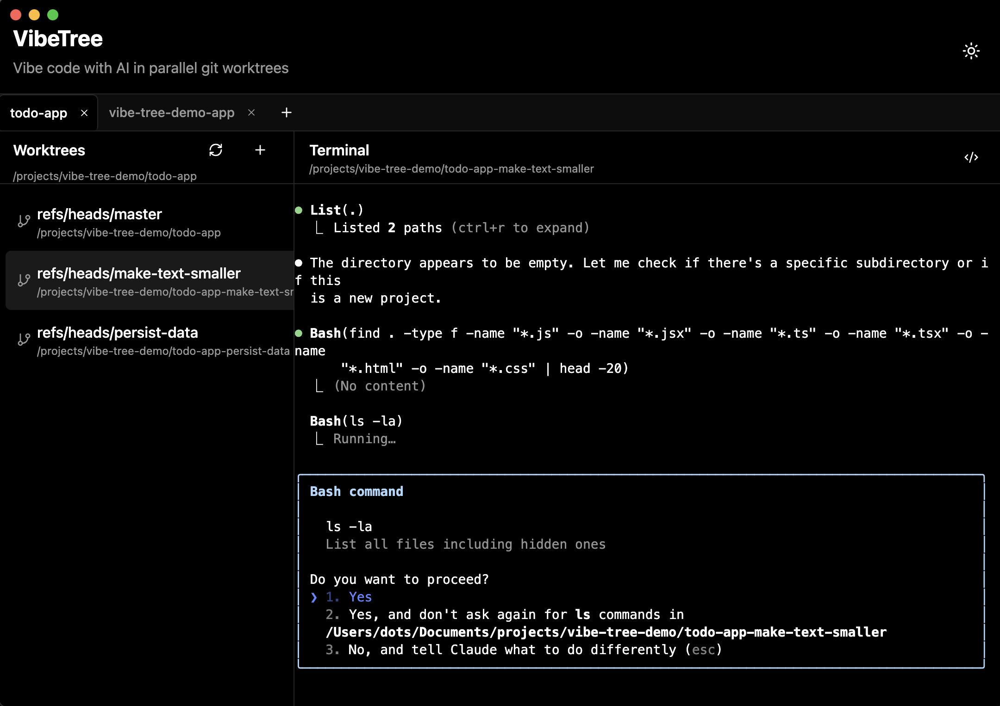
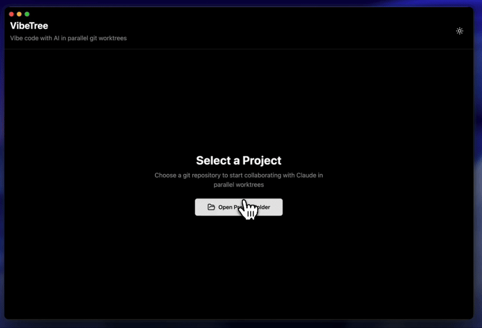

<div align="center">
  
  
  # VibeTree
  
  **Vibe code with AI in parallel git worktrees**
  
  [](https://opensource.org/licenses/MIT)
  [](https://github.com/sahithvibudhi/vibe-tree/releases)
</div>

---

> [!IMPORTANT]
> 🚧 **Active Development Notice**: We're currently working on adding cloud support and multi-platform capabilities. 
> For a stable desktop-only version, please use the [`release-v0.1`](https://github.com/sahithvibudhi/vibe-tree/tree/release-v0.1) branch.

---

VibeTree is a cross-platform application that enhances your development workflow by enabling parallel development with AI assistance across multiple git worktrees. Work on features simultaneously without context switching. Access from desktop, browser, or mobile devices.

## Screenshot



## Demo



## Installation

### Quick Start

```bash
# Install dependencies
pnpm install

# Run both web and server (recommended)
pnpm dev:all

# Or run services separately:
pnpm dev:server  # Socket server on :3002
pnpm dev:web     # Web app on :3000
pnpm dev:desktop # Desktop app
```

### Desktop App

Download the latest release for your platform from the [Releases page](https://github.com/sahithvibudhi/vibe-tree/releases):

- **macOS**: Download `.dmg` file (supports both Intel and Apple Silicon)
- **Windows**: Download `.exe` installer
- **Linux**: Download `.AppImage` or `.deb` file

### Web/Mobile Access

1. Start services: `pnpm dev:all`
2. Access locally: http://localhost:3000
3. For mobile/network access:
   - Scan the QR code shown in terminal
   - Or navigate to the network URL (e.g., http://192.168.1.x:3000)

**Safari/iOS Requirements:**
- Both services must be running (web on :3000, server on :3002)
- Allow firewall connections on both ports if prompted

#### LAN Dev Mode (no pairing)
When opening from a phone on your Wi‑Fi, the web UI loads over LAN and the web app connects to the socket server via WebSocket on :3002. In development, enable LAN WebSocket access without pairing:

```bash
# Allow LAN connections to the WebSocket server in dev (no auth)
ALLOW_INSECURE_NETWORK=1 HOST=0.0.0.0 PORT=3002 pnpm dev:server
pnpm dev:web
```

Then open the printed Network URL (e.g., http://192.168.1.x:3000) on your phone. If you still see "Not connected", you can explicitly point the web app at the socket server by creating `apps/web/.env`:

```ini
VITE_WS_URL=ws://192.168.1.x:3002
```

### Environment Variables

Create `.env` files as needed:

```bash
# apps/web/.env (optional)
VITE_WS_URL=ws://192.168.1.100:3002  # For custom socket server
VITE_PROJECT_PATH=/path/to/project    # Override project path

# apps/server/.env (optional)
PORT=3002                              # Socket server port
HOST=0.0.0.0                          # Bind to all interfaces
PROJECT_PATH=/path/to/project          # Default project path
# In dev, allow unauthenticated LAN WebSocket connections (use only on trusted networks)
# Any of these enables it:
# ALLOW_INSECURE_NETWORK=1
# ALLOW_INSECURE_LAN=1
# ALLOW_NETWORK_DEV=1
```

## Features

- **Parallel Development** - Work on multiple features simultaneously without stashing or switching branches
- **Persistent Terminal Sessions** - Each worktree maintains its own terminal session with full state preservation
- **Claude CLI Integration** - Seamlessly work with Claude in each terminal
- **IDE Integration** - Open any worktree directly in VS Code or Cursor
- **Multi-Project Support** - Work with multiple repositories in tabbed interface
- **Cross-Platform Access** - Desktop app, web browser, and mobile support
- **Dark/Light Mode** - Automatic OS theme detection with manual toggle
- **macOS Native** - Proper traffic light window controls integration

## Roadmap

- [x] Mobile access - Access from your phone via web browser
- [ ] Claude notifications - Get notified when Claude finishes tasks or needs user input
- [ ] PWA offline support - Work offline on mobile devices

## Contributing

Contributions are welcome! Please read our [Contributing Guidelines](CONTRIBUTING.md) for details on our code of conduct and the process for submitting pull requests.

## License

MIT License - see the LICENSE file for details.
